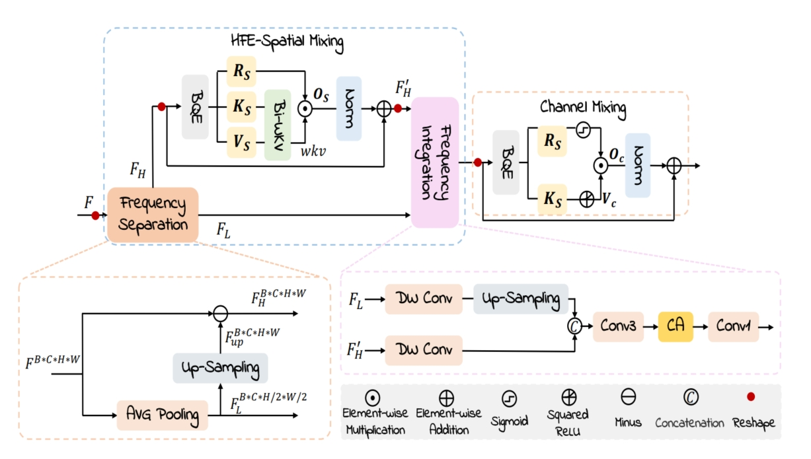

# HFE-RWKV
Official implementation code for [_HFE-RWKV: High-Frequency Enhanced RWKV  Model for Efficient Left Ventricle Segmentation in  Pediatric Echocardiograms_](https://) paper

---



---
## Prepare data

### 1. DataSplit.py

- The `DataSplit.py` script is used to divide the EchoNet-Pediatric dataset into three subsets.
- The `Prepare_US.py` script is designed to preprocess the dataset for input into the model. 

**Notice:**

**Dataset Name**: EchoNet-Pediatric  
**Project URL**: [https://echonet.github.io/pediatric/](https://echonet.github.io/pediatric/)

---
## Environment and Installation

- Please prepare an environment with python=3.7, and then use the command "pip install -r requirements.txt" for the dependencies.
---
## Train and Test
- The batch size we used is 24. If you do not have enough GPU memory, the bacth size can be reduced to 12 or 6 to save memory.

- Train 

```bash
 python train.py --cfg configs/config_skin.yaml --path_to_data your DATA_DIR --saved_model your OUT_DIR
```

- Test 

```bash
python test.py
```
---
## Updates
- December 27, 2024: Accepted by ICASSP2025.
---
## References
- [Swin-Unet](https://github.com/HuCaoFighting/Swin-Unet)
---
## Citation
```
@article{,
  title={HFE-RWKV: High-Frequency Enhanced RWKV  Model for Efficient Left Ventricle Segmentation in  Pediatric Echocardiograms},
  author={Zi Ye, Tianxiang Chen, Ziyang Wang, Hanwei Zhang, and Lijun Zhang},
  journal={},
  year={}
}
```
